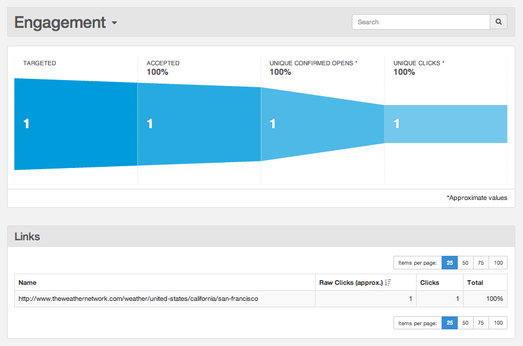

| [Prev](sending_cc_bcc)  | Part VII. Message Generation (HTTP) |  [Next](p.analytics) |

## Chapter 53. Using Complex Templates

**Introduction**

Most likely, your messaging needs go way beyond the simple examples provided in the previous tutorials. Yet, these examples form the basis for creating effective, high-volume messaging campaigns. By further exploring the capabilities of Momentum's powerful templating language, you can create templates that implement complex structures such as conditional statements, looping, and customized links.

**Creating a Complex Stored Template Using the REST API**

In this section, you will learn about advanced features of the templating language. It combines many of the topics discussed in previous tutorials to create and use a complex template.

### Note

This tutorial assumes that you have completed the tutorials in [Chapter 47, *Creating Stored Templates*                 ](stored_template "Chapter 47. Creating Stored Templates") and [Chapter 49, *Using Stored Templates*](using_template "Chapter 49. Using Stored Templates") .

A general knowledge of command line tools, JSON, HTTP protocol, and templating languages is required. As a prerequisite, you should also be familiar with the information provided in the Substitutions Reference section of the [Momentum 4 REST API](https://support.messagesystems.com/docs/web-rest/v1_index.html) documentation.

You must have a valid API key to complete this tutorial. If you do not, see [Chapter 43, *Creating an API Key*](create_apikey "Chapter 43. Creating an API Key") .

Follow these steps to create a complex template:

1.  Specify your input data for the template.

    This example demonstrates using substitution data and Momentum's templating language to create a complex template for a flight notification email. It also introduces the "html" content type, which gives you a richer look and feel than a plain-text message.

    In addition to the simple substitution shown in previous tutorials, this example uses a conditional statement to form the message body. If there is no departing airport specified in the substitution data provided with the transmission, the message body will inform the recipient that there are no travel plans. Otherwise, the message body will provide the recipient with the departing and arriving airport and city based on the substitution data provided for that specific recipient. The conditional statement is the following:

    ```
    {{if not Airports[departAirport]}}
      Hi {{ firstName or 'there' }}, You do not appear to be traveling anywhere. This email must be a mistake.
    {{else}}
    {{if Airports[departAirport] and Airports[departAirport].city then}}
      Hi {{ firstName or 'there' }}, You are planning a trip from {{departAirport}} in {{Airports[departAirport].city}} »
      to {{arriveAirport}} in {{Airports[arriveAirport].city}}.
    {{end}}
    {{end}}
    ```

    This example also demonstrates how substitution data can be used to custom a link within the message body. The customized link is the following:

    ```
    The weather in {{Airports[arriveAirport].city}} is <a href=\"http://www.theweathernetwork.com/weather/»
    {{Airports[arriveAirport].country}}/{{Airports[arriveAirport].region}}/{{Airports[arriveAirport].weatherc}}»
    \"target=\"_blank\"> {{Airports[arriveAirport].city}}.
    ```

    Using your text editor, create the following JSON file named `complex_template.json`.

    Note that the "html" part must be all on one line. Multiple lines are shown here for readability.

    ```
    {
       "id":"complex_template",
       "published":false,
       "options":{
          "open_tracking":true,
          "click_tracking":true
       },
       "content":{
          "from":"{{senderAddress}}",
          "subject":"This is a {{SubjectText}} of a flight notification from {{departAirport}} to {{arriveAirport}}",
          "html":"<p>{{if not Airports[departAirport]}}Hi {{ firstName or 'there' }},<br>You do not appear to be traveling »
          anywhere. This email must be a mistake.<br>{{else}}{{if Airports[departAirport] and Airports[departAirport].city »
          then}}Hi {{ firstName or 'there' }},<br>You are planning a trip from {{departAirport}} in {{Airports[departAirport]»
          .city}} to{{arriveAirport}} in {{Airports[arriveAirport].city}}.<br>{{end}}The weather in {{Airports[arriveAirport]»
          .city}} is <a href=\"http://www.theweathernetwork.com/weather/{{Airports[arriveAirport].country}}/{{Airports[arrive»
          Airport].region}}/{{Airports[arriveAirport].weatherc}}\"target=\"_blank\"> {{Airports[arriveAirport].city}}.{{end}}»
          </a></p>"
       }
    }
    ```

2.  Store your template as a draft.

    At the command line, enter the following command to store your template:

    curl -X POST http://*`your.server.domain`*/api/v1/templates/ \
    -d @*`path/to/file/`*complex_template.json \
    -H "Content-Type: application/json" \
    -H "Authorization: *`your_api_key`*"

    where `complex_template.json` is the name of your JSON file, `application/json` specifies the format as JSON, and *`your_api_key`* is your valid API key.

    If successful, the following response will be displayed at the command line:

    ```
    {
       "results":{
          "id":"complex_template"
       }
    }
    ```

    This response shows that the request was successful.

**Create Transmission**

Follow these steps to send an email using your template:

1.  Specify your input data for the transmission.

    As in the tutorial on using a simple stored template, you use a template by specifying its identifier and the recipient-specific data as input data in the JSON blob that will be included in the Transmissions API call.

    Using your text editor, create the following JSON file named `complex_subdata.json`. Be sure to use your information for sender address, recipient address, and recipient name.

    {
       "options":{
          "open_tracking":true,
          "click_tracking":true
       },
       "return_path":"*`sender@your_address.com`*",
       "substitution_data":{
          "senderAddress":"*`sender@your_address.com`*",
          "SubjectText":"complex template example",
          "Airports":{
            "YYZ":{
                "code":"YYZ",
                "city":"Toronto",
                "name":"Toronto International Airport",
                "country":"canada",
                "region":"ontario",
                "weatherc":"toronto"
             },
             "SFO":{
                "code":"SFO",
                "city":"San Francisco",
                "name":"San Francisco International Airport",
                "country":"united-states",
                "region":"california",
                "weatherc":"san-francisco"
             },
            "BWI":{
                "code":"BWI",
                "city":"Baltimore",
                "name":"Baltimore-Washington International Airport",
                "country":"united-states",
                "region":"maryland",
                "weatherc":"baltimore"
             }
          }
       },
       "recipients":[
          {
             "address":{
                "email":"*`recipient@their_address.com`*"
             },
             "substitution_data":{
                "firstName":"*`recipient first name`*            ",
                "departAirport":"YYZ",
                "arriveAirport":"SFO"
             }
          }
       ],
       "content":{
          "template_id":"complex_template",
          "use_draft_template":true
       }
    }

    The recipient-specific data JSON blob can include any number of substitutions. In this example, the transmission JSON structure includes multiple options for airports, while the recipient JSON structure includes only one recipient. You can easily expand either structure for multiple substitution values.

2.  Inject your message into Momentum.

    At the command line, enter the following command to inject your email:

    curl -X POST http://*`your.server.domain`*/api/v1/transmissions/ \
    -d @*`path/to/file/`*complex_subdata.json \
    -H "Content-Type: application/json" \
    -H "Authorization: *`your_api_key`*"

    where `complex_subdata.json` is the name of your JSON file, `application/json` specifies the format as JSON, and *`your_api_key`* is your valid API key.

    If successful, a response similar to the following will be displayed at the command line:

    {
       "results":{
          "total_rejected_recipients":0,
          "total_accepted_recipients":1,
          "id":"*`11936056773443588`*"
       }
    }

    This response shows that one email was accepted and none were rejected.

**View Engagement Data**

Follow these steps to view your engagement data:

1.  Open the email and click the link.

    Verify that your recipient received a personalized email. Open the email and click the link included in the message body.

2.  Open the UI and navigate to the Engagement report. In the Engagement report, confirm that your message was successfully injected into Momentum (Targeted), accepted by the ISP (Accepted), and opened (Unique Confirmed Opens) and that the link was clicked (Unique Clicks), as shown in [Figure 53.1, “Engagement Report”](complex_template#figure_engagement_example "Figure 53.1. Engagement Report").

    <a name="figure_engagement_example"></a>

    **Figure 53.1. Engagement Report**

    

Congratulations! You have used your knowledge of the REST API to create and use a complex template. For additional information, see [Momentum REST API](https://support.messagesystems.com/docs/web-rest/v1_index.html).

|     |     |     |
| --- | --- | --- |
| [Prev](sending_cc_bcc)  | [Up](p.http_rest) |  [Next](p.analytics) |
| Chapter 52. Sending Emails as CC and BCC  | [Table of Contents](index) |  Part VIII. Reporting and Engagement Tracking |

