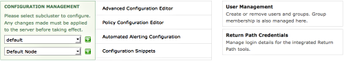
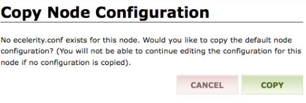
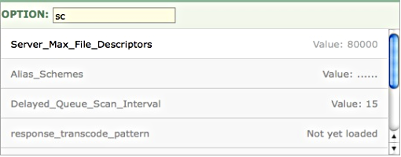
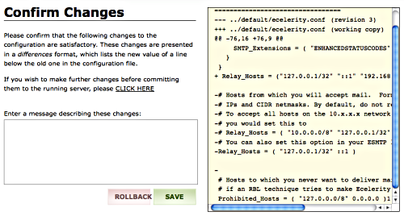
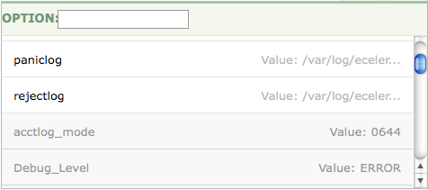
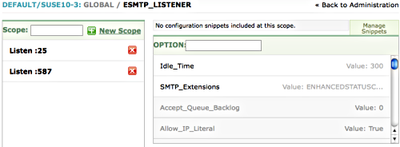

| [Prev](web3.paths_page)  | Chapter 3. Using the Web Console |  [Next](web3.users) |

## 3.8. Administration

The options available from the Administration page are pictured in the following image:

**Figure 3.32. Administration options**

Use Advanced Configuration Editor to change the configuration of Momentum. You can add or remove modules or listeners and also change their configuration

The Policy Configuration Editor menu option provides a graphical tool for implementing policy scripts. *Note*: This page is not currently available for Momentum for Receiving.

The Automated Alerting Configuration menu option provides a graphical tool for implementing alerting scripts.

The Configuration Snippets menu option provides a tool for creating reusable configuration code snippets.

The User Management menu is used to create, remove or update users and groups. This menu option only appears if a superuser logs in. The user named `admin` created during installation is a superuser.

### Note

The User Management menu is unavailable if you choose to authenticate against Active Directory.

The Return Path Credentials menu is used to manage the Return Path Tools.

The drop-down list boxes on the left, determine how any changes you make are applied. In a cluster configuration you can select a specific subcluster and node to edit and your changes will only apply to the selected node. To make changes that apply to all nodes select the `default` subcluster and the `default` node. In a cluster configuration, you need to select from these list boxes before the central menu options are enabled.

If you decide to make changes to a specific node, you will be asked to create a copy of the default configuration file. You should see a screen similar to the following:

**Figure 3.33. Copy node configuration**

After clicking the COPY button, you must commit your changes in order for them to take effect. Committing your changes creates a directory below the `/opt/msys/ecelerity/etc/conf` directory bearing the name of the node. In this directory you will find an `ecelerity.conf` file that is applicable to this node only. You now have an `ecelerity.conf` file specific to this node.

### Note

When you create a node-specific configuration file, the directory bearing the node name and the node-specific `ecelerity.conf` file is created on all nodes in the cluster.

### 3.8.1. Configuring Momentum Using the Web Console

The simplest way to configure Momentum in version 3.0 is by using the web console.

Changing your configuration through the web UI changes a session-specific checkout of the configuration file stored in the repository and any changes are validated when they are committed. Every minute the running configuration is checked for updates by a cron job and if the on-disk configuration changes, the running Momentum process is reloaded.

You can change configuration options manually by directly editing the `ecelerity.conf` file. To avoid possible conflicting changes, don't do this while the web console is running. For instructions on manually changing configuration files see [Section 2.8, “Best Practices for Manually Changing Configuration Files”](conf.manual.changes "2.8. Best Practices for Manually Changing Configuration Files"). If you make manual changes that conflict with changes made through the web UI, the running configuration will *not* get replaced with the repository version.

### Note

Options that relate to configuration of the cluster manager or the message bus, must be configured manually. For more information see [eccluster.conf](eccluster.conf3 "eccluster.conf") and [mbus.conf](mbus.conf "mbus.conf").

As of version 3.4, the `mbusd.conf` file is no longer used. For more information see [Section 14.47, “msgc – Modules”](modules.msgc "14.47. msgc – Modules").

**3.8.1.1. Changing Global Configuration Options**

To change or add configuration options, navigate to the Administration page. Use the drop-down list boxes on the left to determine which node or nodes your changes will affect and then choose the Advanced Configuration Editor option.

When you first navigate to this page the default scope is the global scope and all the options that are valid in the global scope appear in the option box pictured in [Figure 3.34, “Global configuration options”](web3.administration#figure_global_options "Figure 3.34. Global configuration options").

**Figure 3.34. Global configuration options**

Options that are specified in your configuration file are shown in normal type. If an option is grayed-out then it hasn't been specified. If a grayed-out option has a default value, it is shown. In [Figure 3.34, “Global configuration options”](web3.administration#figure_global_options "Figure 3.34. Global configuration options"), `Alias_Schemes` has not been specified and does not have a default value. On the other hand, `Server_Max_File_Descriptors` has been specified and has a value of `80000`.

To add or edit an option simply click it and set its value. To search for a value, enter the option name into the text box labelled OPTION. The list of options is updated as you type.

Be sure to click Commit All Changes when you are finished.

If the current value of an option differs from the default value, you can "assign" the default value by locating the option and then choosing the DEFAULT button. The DEFAULT button only appears when an option has a default value and has also been assigned a value (regardless of whether that value is the default or not). Clicking this button removes the specific option from the configuration file, effectively assigning it its default value.

**3.8.1.2. Committing Changes**

Pressing the Commit All Changes button displays the following screen:

**Figure 3.35. Commit screen**

Press the Commit button to confirm your changes. When your changes have been processed you should see the message `Configuration Successfully Saved`.

If you decide against the changes, use the Rollback button.

### Warning

If you think that changes may have been made by someone else since your web UI session started, you should consider rolling back any pending changes you may have made (especially if you suspect they might conflict). You may want to log out and back in again to make sure that your working copy is fully up to date.

**3.8.1.3. Implicitly Loaded Scopes**

Some scopes that appear in the web UI need not ever be explicitly loaded.

*   `select_scheduler` and `devpoll_scheduler`

    These scopes represent the various platform specific schedulers; the best available scheduler is loaded on demand and these scopes need not be set explicitly. The `Scheduler_Selection` option affects which of these are loaded and used.

*   `xclient_inbound, xremoteip_inbound, xsetcontext_inbound` and `xdumpcontext`

    These scopes never need to be loaded explicitly; the `SMTP_Extensions` option affects which of these are loaded and used.

**3.8.1.4. The `Custom` Value**

When there is an option such as `Blackhole`, with values that map to specific numeric values, the web UI lets you select `Custom` and configure the raw value. However, you would rarely choose `Custom`, and certainly not with the `Blackhole` option. One option where a custom value may sometimes make sense is `Connection_Allocation_Aggressiveness`. Before changing a custom value be sure to consult the option documentation.

**3.8.1.5. Changing Module Configuration Options**

To change or add a module configuration option navigate to the Administration page choose the Advanced Configuration Editor menu and select a module from the list box on the left. After selecting a module you should see a list of all available options on the left side of the screen. The following image shows a partial list of the ec_logger options:

**Figure 3.36. Module configuration options**

Options that are currently specified in your configuration file are shown in normal type and grayed-out options indicate options that are not specified. If a grayed-out option has a default or a fallback value it is also shown. For example, in [Figure 3.36, “Module configuration options”](web3.administration#figure_module_options "Figure 3.36. Module configuration options"), `Debug_Level` has not been specified but has a default value of `ERROR`.

To add or edit an option simply click it and set its value. To search for a value, enter the option name into the text box labelled OPTION. The list of options is updated as you type.

Be sure to click Commit All Changes when you are finished.

For a complete list and explanation of the options available for each module see [Chapter 14, *Modules Reference*](modules "Chapter 14. Modules Reference") .

**3.8.1.6. Adding a Module**

To add a module navigate to the Administration page and choose the Advanced Configuration Editor option. Click the New Scope button to create a new module and you should see a list of available modules as shown in the following:

**Figure 3.37. Adding a new module**

Choose the module you wish to add. If the module you are adding is not a singleton, you must give the module a name by entering text into the available textbox. For more information on this topic see [module](console_commands.module "module"). Edit a module's options as shown in [Section 3.8.1.5, “Changing Module Configuration Options”](web3.administration#web3.module_config "3.8.1.5. Changing Module Configuration Options").

Be sure to click Commit All Changes when you are finished.

**3.8.1.6.1. Adding an ECStream_Listener**

The ECStream_Listener does not appear in the list box of scopes until the `ecstream` module is added. To add an ECStream_Listener follow these steps:

1.  Click the New Scope button and select the `ecstream` scope.

2.  Create the ecstream scope and commit the change.

3.  Click the New Scope button and find the ECStream_Listener in the list box.

4.  Add an ECStream_Listener and commit your changes.

**3.8.1.7. Adding a Sieve Module**

The sieve module is used to implement policy. For a description of Sieve see [Chapter 8, *Sieve++*](sieve "Chapter 8. Sieve++") and for an example of implementing policy using Sieve see [Section 5.4, “Implementing Policy Using Sieve”](policy.implementing "5.4. Implementing Policy Using Sieve").

Sieve scripts are run at specific hook points or during a specific phase. Before adding the sieve module, you need to create a script. Sample Sieve scripts are found in the `/opt/msys/ecelerity/etc/sieve-scripts/` directory. You can adapt these scripts for your own purposes and save them wherever you like. You can also use the revision control system to keep track of any changes and to share files across different nodes. This is described in [Section 14.64.2, “Sieve Scripts and Revision Control”](modules.sieve#modules.sieve.revision.control "14.64.2. Sieve Scripts and Revision Control").

A sieve module is added in the same way as any other module. This process is described in [Section 3.8.1.6, “Adding a Module”](web3.administration#web3.adding_module "3.8.1.6. Adding a Module").

The point of adding a sieve module is in order to run a script at a specific phase. To do this you must add a script scope as shown in the following:

**Figure 3.38. Adding a script scope**

The name of a script scope cannot be an arbitrary name of your choosing. The scope name must be a valid script phase. Valid phases are:

*   accept_phase1

*   accept_phase2

*   connect_phase1

*   connect_phase2

*   ehlo_phase1

*   ehlo_phase2

*   mailfrom_phase1

*   mailfrom_phase2

*   rcptto_phase1

*   rcptto_phase2

*   data_phase1

*   data_phase2

*   spool_phase1

*   spool_phase2

*   each_rcpt_phase1

*   each_rcpt_phase2

*   set_binding_phase1

*   set_binding_phase2

Phase1 and Phase2 allow Sieve scripts to be split across two files while remaining completely self-contained and operational. This is useful for separating site-specific Sieve logic from vendor and/or third party Sieve logic. The convention is to run site-specific scripts during phase1 and vendor supplied rulesets during phase2.

*Note*: If you do not use one of the legitimate phase names, creation of the script scope fails and you will not be able to continue.

Once the script scope is created, you **must** identify the script that will run by setting the `source` option of the script scope. Do this by pointing the source to the desired script.

### Note

A live server will never reload a faulty configuration. Any errors that you introduce into your configuration come into effect on reboot or when the ecelerity process is restarted. For example, if you do not set `source` to a valid file, affected nodes will fail to start the MTA on reboot.

Within the sieve scope you may also configure the `cache_size` and `cache_life` options. The `cache_size` and `cache_life` options control the number of compiled script cache entries to maintain, and the time-to-live for those entries. These options have default values of `200` and `260` respectively. The compiled script cache is used whenever your Sieve scripts use the `ec_include` action to include another Sieve script. Both of these values are also tunable from the system console.

### 3.8.2. Modifying a Binding

To change a binding navigate to the Administration page and choose the Advanced Configuration Editor option. To change an existing binding, select the desired binding from the list box on the left, click it and you should see a list of all available options on the right side of the screen.

**Figure 3.39. Modifying a binding**

Binding options are modified in exactly the same way as global options. For more information see [Section 3.8.1.1, “Changing Global Configuration Options”](web3.administration#web3.global_config "3.8.1.1. Changing Global Configuration Options").

### 3.8.3. Modifying a Listener

To change a listener navigate to the Administration page and choose the Advanced Configuration Editor option. Select the desired listener from the list box, click it and you should see something similar to the following:

**Figure 3.40. ESMTP_Listener**

This displays the ESMTP_Listener in the global scope. Two listen stanzas are shown on the left and options valid within the ESMTP_Listener scope are shown on the right.

Adding or editing options that are valid in the ESMTP_Listener scope is the same as editing a module option. For a description of this task see [Section 3.8.1.5, “Changing Module Configuration Options”](web3.administration#web3.module_config "3.8.1.5. Changing Module Configuration Options").

To add or edit options in the `Listen` scope select the scope you wish to change and its options show up in the option list on the right. Scroll down to find a specific option or search for it by entering the option name in the text box beside OPTION:.

As with module options, options that are not explicitly set are grayed.

Be sure to click the Update button and the Commit All Changes button when you are finished.

**3.8.3.1. Configuring the ECStream_Listener in the Web UI**

If you are adding an ECStream_Listener using the web UI, you must first add the `ecstream` module. You cannot configure ECStream options until the `ecstream` module has been added.

### 3.8.4. Creating Configuration Snippets

Configuration snippets can be especially useful when you need to add the same or similar code to different nodes in a cluster.

Use the Configuration Snippets menu item to navigate to the Configuration Snippet Library. When you first navigate to this page you should see something like the following:

**Figure 3.41. Configuration snippets**

The CREATE A NEW SNIPPET frame is used to create new snippets. The textbox is used for the snippet name. Use the Select Type drop-down list box to set the type to one of the following values:

*   General Snippet

*   Binding Snippet

*   Domain Snippet

The Select Availability drop-down list box is used to determine whether the snippet applies to the whole cluster, to a subcluster or is specific to a particular node. A cluster-wide snippet appears under the Global Configuration Snippets column and node-specific snippets under the column bearing the node or subcluster name.

To create a snippet, enter a name in the textbox and select the the type of snippet that you would like to create. Doing this opens a new configuration page with the appropriate scopes on the left hand side and options on the right.

### Note

A temporary file is used during the process of creating a snippet. For this reason you are encouraged to use only alphanumeric characters and underscores in snippet names. If you use other characters, Momentum will attempt to convert them into an ‘`_`’.

For example, if you choose to create a binding snippet you can choose a `Domain` or `Host` scope from the scope type drop-down list box. Options visible within the binding scope are displayed on the right hand side of the page. The binding snippet will have the default name `Inconsequential`. When you have finished creating a snippet click the Done button. This saves the snippet and returns you to the Configuration Snippet Library page and displays the newly created snippet under the appropriate column.

Any configuration snippets can be edited by clicking the snippet name. To delete a snippet click the X button. Snippets are saved to the repository so don't forget to commit your changes.

When using the advanced configuration editor, you can access existing snippets by clicking the Manage Snippets button. Clicking this button opens a snippet management frame as pictured below:

**Figure 3.42. Accessing snippets**

Only snippets that are visible in the current scope are displayed. For example, if you are configuring a specific node, no global configuration snippets will be visible.

To add a snippet, select the snippet that you wish to add and click the ADD button. For a snippet addition to take effect, you must commit your changes. Once you have included a snippet, the message to the left of the Manage Snippets button changes from `No configuration snippets included at this scope` to `There is one snippet included at this scope`.

Use the snippet management frame to remove a snippet from your configuration. To remove a snippet click the X beside the desired snippet. *Note*: Doing this removes the snippet from your configuration but does not remove it from the Configuration Snippet library.

| [Prev](web3.paths_page)  | [Up](web3) |  [Next](web3.users) |
| 3.7. The Paths Page  | [Table of Contents](index) |  3.9. Administering Users From the Web Console |
