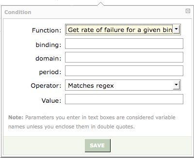
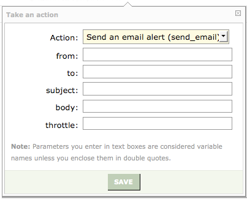

|     |     |     |
| --- | --- | --- |
| [Prev](web3.policy.editor)  | Chapter 3. Using the Web Console |  [Next](operations) |

## 3.11. Automated Alerting Configuration

To navigate to the automated alerting page choose Automated Alerting Configuration from the Administration menu.

You can use automated alerting to track the following events:

*   Rejections – Track when permanent failure rates on a Binding or a Domain exceed a defined percentage.

*   Errors – Track when a line is written to paniclog.ec with debug condition of ERROR or higher.

The response can be in the form of an email or an SNMP trap.

### Note

Automated alerting requires that TMPDIR *not* be mounted with the `noexec` option. For more information see [Section 2.1.5.1, “The `environment` File”](conf.ecelerity.conf#conf.environment.file "2.1.5.1. The environment File").

### 3.11.1. Creating Rejection Alerts

Rejection-based alerting only make sense if used with the `get_binding_domain_failure_rate` function, otherwise no meaningful results are produced. This "phase" alerts an administrator when delivery rates exceed a certain rejection threshold. These scriptlets are run at one minute intervals. For detailed documentation of the `get_binding_domain_failure_rate` function see [Section 3.11.1.1, “The `get_binding_domain_failure_rate` Function”](web3.automated.alerting#web3.get_binding_domain_failure_rate "3.11.1.1. The get_binding_domain_failure_rate Function").

The interface for automated alerting is identical to the policy editor interface. Select the type of alert that you wish to create by choosing either the REJECTIONS ALERTS tab or the LOG ALERTING tab.

If you select REJECTION ALERTS and then choose to define a condition, you should see something similar to the following:

<a name="figure_rejection_action"></a>

**Figure 3.53. Rejection alert action**


As you can see, the available actions are:

*   Assign a variable – Variables are described in detail in [Section 3.10.3, “Using Variables”](web3.policy.editor#web3.policy.editor.variables "3.10.3. Using Variables").

*   Perform a regex match – Regex matching is described in detail in [Section 3.10.5, “Using Regular Expressions with the Policy Editor”](web3.policy.editor#web3.policy.editor.regex "3.10.5. Using Regular Expressions with the Policy Editor").

*   Get rate of failure for a given binding/domain combo – This is described in detail in [Section 3.11.1.1, “The `get_binding_domain_failure_rate` Function”](web3.automated.alerting#web3.get_binding_domain_failure_rate "3.11.1.1. The get_binding_domain_failure_rate Function").

*   Send an email alert – See the explanation following [Figure 3.55, “Email alert”](web3.automated.alerting#figure_email-alert "Figure 3.55. Email alert").

*   Send an SNMP trap – This is described following [Figure 3.56, “SNMP alert”](web3.automated.alerting#figure_snmp_alert "Figure 3.56. SNMP alert").

If you choose `Get rate of failure for a given binding/domain combo(get_binding_domain_failure_rate)` you will need to supply an existing binding and domain pair. The `period` is the time window in seconds over which you are tracking the failure rate.

<a name="figure_rejection_condition"></a>

**Figure 3.54. Rejection condition**



Use the action `Get rate of failure for a given binding/domain combo` to create a rejection rate condition. Note that this rate will be a floating-point number obtained by comparing the number of messages that fail permanently to the total number of messages sent on a specific Binding::Domain.

If you choose to send an email as a result of exceeding the specified failure rate you need to provide the information as shown in the following image:

<a name="figure_email-alert"></a>

**Figure 3.55. Email alert**



Builds a simple, non-MIME, RFC2822 email message based on the supplied sender, recipient, subject and body content. The from and to must be simple RFC2821 email addresses, that is, addresses of the form user@domain with no friendly names or other surrounding punctuation.

Pass in the following values in this order:

1.  from: the envelope sender, the "From" header for the generated email

2.  to: the envelope recipient, the "To" header for the generated email

3.  subject: the subject line for the generated email

4.  body: the body of the message

5.  throttle: if non-zero, limits sending to one message every "throttle" seconds.

The body will have its line endings canonicalized and apply SMTP transfer encoding (also known as "dot-stuffing") applied. The generated message will have a Message-ID, Date and Received header generated, will be submitted for binding assignment, digital signing, be logged as a reception and then injected into the mail queue.

**3.11.1.1. The `get_binding_domain_failure_rate` Function**

This function is only available for rejection-based alerts. It is intended to be called multiple times within the scriptlet (usually as a condition of an `If` statement). It returns the percentage failure rate of deliveries to a given binding/domain combination over a given period.

Zero is returned if not enough data is available to make a result "statistically valid" (fewer than 100 attempted deliveries), the binding is not found, or the domain is not found.

This function expects the following arguments:

*   `binding` – a string representing the binding in the binding/domain combination.

*   `domain` – a string representing the domain in the binding/domain combination.

*   `period` – an integer value in seconds representing the period over which the alert is valid.

The following pseudo-code illustrates the use of this function:

<a name="web3.example."></a>

**Example 3.1. get_binding_domain_failure_rate example**

```
If ANY of the following conditions are met:
get_binding_domain_failure_rate("default", "test.messagesystems.com", 1800) Greater than 0.1
Then take the following action(s):
send_email("alert@example.com", "admin@company.com", "failure, test.messagesystems.com",
  "test.messagesystems.com threshold exceeded", 180)

If ANY of the following conditions are met:
get_binding_domain_failure_rate("pink_binding", "hotmail.com", 3600) Greater than 0.5
Then take the following action(s):
send_trap("string", "50% failure to hotmail.com", "10.10.19.83", "662",
  "public", "1.3.6.1.4.1.19552.1.4.7", "1.3.6.1.4.1.19552.1.4.1.0", 120)
```

In this example, an email will be sent if more than 10% of the mail delivery attempts to `test.messagesystems.com` over the default binding fail within a 30 minute period, and an SNMP trap will be generated if more than 50% of email delivery attempts to `hotmail.com` over `pink_binding` fail within an hour period.

As of version 3.0.17, you may use `send_email` to send email to multiple recipients. Use commas or spaces to separate recipients.

### 3.11.2. Logging Alerts

Use the Logging Alerts tab to create an email alert when a line is written to the `paniclog.ec` file with a debug level of `ERROR` or `CRITICAL`. This is done in exactly the same way that a rejection alert is created.

If you wish to send an SNMP alert instead of an email alert you need to supply the values shown in the following image:

<a name="figure_snmp_alert"></a>

**Figure 3.56. SNMP alert**


A description of the fields follows:

*   `type` – The data type of the payload. Can be one of "string", "counter", "gauge" or "ip".

*   `payload` – The data to be sent with the trap. For "string" data, this must be a string. For "ip" data, this must be a string version of an IPv4 address. For "counter" and "gauge" types, it must be numeric.

*   `address` – The trap server address; an IPv4 address string.

*   `port` – The port number of the trap server.

*   `community` – The community for authorization by the trap daemon.

*   `mib` – The Management Information Base (MIB) for the trap. If not specified, this defaults to the Momentum enterprise MIB ("1.3.6.1.4.1.19552.1.4.7").

*   `trapvarmib` – The Object IDentifier (OID) to use for the trap variable. If unspecified, defaults to "1.3.6.1.4.1.19552.1.4.1.0".

*   `throttle` – If this value is non-zero, it limits sending to one trap every "throttle" seconds. For example, if `throttle` is set to `300`, then an email alert may be sent every 5 minutes. If multiple paniclog entries of debug level `ERROR` or `CRITICAL` are written within 5 minutes, then only one email alert is sent.

Also choose the desired operator and value. You can access the log entry using the `logline` variable which contains the entire text of the log entry.


|     |     |     |
| --- | --- | --- |
| [Prev](web3.policy.editor)  | [Up](web3) |  [Next](operations) |
| 3.10. The Policy Configuration Editor  | [Table of Contents](index) |  Chapter 4. Operations |
