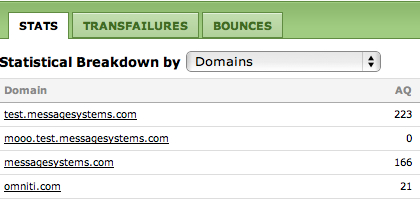
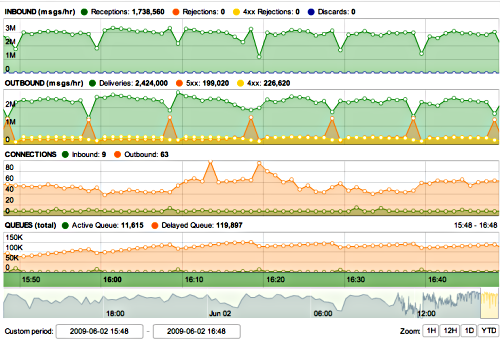
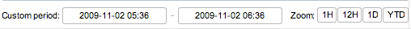

| [Prev](web3.overview)  | Chapter 3. Using the Web Console |  [Next](web3.status) |

## 3.3. The Dashboard

The dashboard is meant to give you a quick overview of the state of your MTA. Summary statistics are shown on the left side of the page as pictured below:

<a name="figure_summary_stats"></a>

**Figure 3.2. Summary statistics**


Summary statistics and queue sizes are shown by protocol. There is provision for displaying SMPP and MM7 statistics even if the Mobile modules are not loaded. If your installation supports Mobile Momentum and you wish to view Mobile statistics in the web UI, be sure to load the "real time" loggers. For more information see [Section 4.5.5, “Logging and the Web UI”](operations.logging#operations.logging.web.ui "4.5.5. Logging and the Web UI").

Real-time statistics are shown on the left side of the page below the summary statistics:

<a name="figure_dashboard_stats"></a>

**Figure 3.3. Real-time statistics**



At a glance you can see the number of items in the active and delayed queues and the number of receptions, deliveries and bounces. Statistics for client errors and rejections are also shown.

When the dashboard is first opened, the STATS tab is selected. You can choose how to view the statistics by choosing from the Statistical Breakdown by drop-down list box. The options are:

*   Domains

*   Bindings

*   Domains and Bindings

Choose the TRANSFAILURES tab to view transient failures and choose the BOUNCES tab to view bounces.

On the right hand side of the screen is a graphical representation of the inbound and outbound queues, the connections and also a graph that shows the total in both queues. You should see something similar to the graphs pictured below:

<a name="figure_dash_graphs"></a>

**Figure 3.4. Dashboard graphs**



By default you are shown statistics for the last hour. If you wish to view a different time period use the controls shown below:

<a name="figure_dash_time_period"></a>

**Figure 3.5. Dashboard time period**



To specify a custom period, use the Custom Period text boxes. You can also zoom in a specific time frame using the buttons to the right of Zoom label.

### 3.3.1. Viewing by Domain

From the dashboard you can view a specific domain by clicking the domain name in the statistical breakdown list or by clicking the DOMAIN menu option on the main menu.

When viewing a specific domain the left side of the screen contains statistical information for that specific domain and graphs of inbound and outbound traffic.

The following tabs are found on the right hand side of the screen:

*   Transfailures

*   Bounces

*   Queues

*   Return Path

*   Stats

The TRANSFAILURES (transient failures) tab shows a list of transient failures with reason, count and percentage columns.

The BOUNCES tab shows all bounces broken down by classification.

The STATS tab shows the same information as is shown in the Real-Time Stats frame but organizes the information by binding.

The RETURN PATH tab shows a deliverability report for the current domain. This tab is for users who subscribe to the [Return Path](http://www.returnpath.net) services.

Return Path provides statistics for email marketing campaigns. These statistics are updated every five minutes by the `/opt/msys/ecwebui/scripts/returnpath_poll.pl` script. Clicking this tab dumps Campaigns and ISP Data from the `returnpath` schema.

Campaigns:

```
campaignid, matchingid, subject, fromdomain, inboxpercent,
bulkpercent, missingpercent, duplicatecount, firstseen, lastseen, customername
```

ISP Data:

```
campaignid, isp, inboxpercent, bulkpercent, missingpercent,
dupicatecount, firstseen, lastseen
```

### Note

The Return Path functionality was removed as of Momentum 3.5.1.

A discussion of the QUEUES tab follows.

**3.3.1.1. The Queues Tab**

Select the QUEUES tab to view mail that is in the queues. The Show drop-down list box lets you view the active queue, the delayed queue or both.

You can view the details of any item in the queue by clicking the + button beside a specific item. Doing this displays the details of an email as shown below:

<a name="figure_queues_detail"></a>

**Figure 3.6. Message details**


When viewing the message detail you can rebounce, purge or retry a specific message using the buttons on the upper left hand side. You can also do this for *all* the messages that appear in the queue.

| [Prev](web3.overview)  | [Up](web3) |  [Next](web3.status) |
| 3.2. Web Console Overview  | [Table of Contents](index) |  3.4. Cluster Status |
