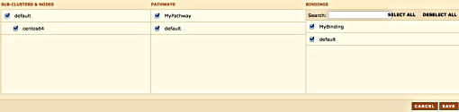
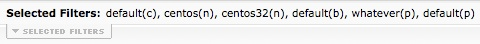

|     |     |     |
| --- | --- | --- |
| [Prev](web3.status)  | Chapter 3. Using the Web Console |  [Next](web3.reports) |

## 3.5. Filtering

In addition to selecting a specific domain you can also filter for specific subclusters, nodes, bindings and, in Momentum for Receiving, pathways. To do this choose the Filter menu option. You should see something similar to the following:

**Figure 3.8. Filtering**

In the SUB_CLUSTERS & NODES section, as a minimum, you must select at least one sub-cluster or one node. Failure to do so results in the following error message: `The subcluster / node selection must contain at least one subcluster or node.` The SUB_CLUSTERS & NODES configuration then reverts to the previous configuration.

In addition to selecting the nodes and subclusters you can also select a specific binding from the list of bindings that appears on the right hand side of the page. As of version 3.0.23, you can also filter pathways.

To select all bindings, click the SELECT ALL link and to deselect all bindings use the DESELECT ALL link.

The filters that you choose show up as the Selected Filters on any web page.

**Figure 3.9. Selected Filters**

The meanings of the letters in parentheses are as follows:

*   `c` – cluster

*   `n` – node

*   `b` – binding

*   `p` – pathway (since 3.0.23)

You can toggle the display of selected filters by clicking the Selected Filters tab.

|     |     |     |
| --- | --- | --- |
| [Prev](web3.status)  | [Up](web3) |  [Next](web3.reports) |
| 3.4. Cluster Status  | [Table of Contents](index) |  3.6. The Reporting Page |
