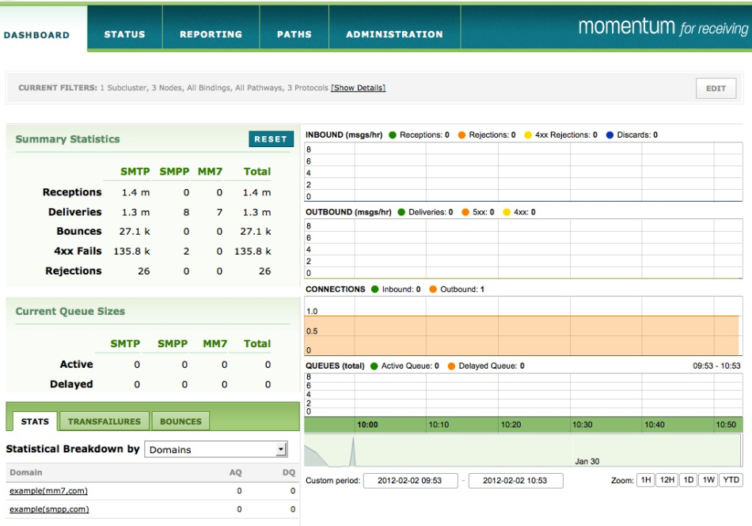

| [Prev](web3.starting.web.console)  | Chapter 3. Using the Web Console |  [Next](web3.dashboard) |

## 3.2. Web Console Overview

The web console opens on the dashboard—a page that gives you a quick overview of the state of your system. The menu options are as shown below.

**Figure 3.1. Overview**

The reporting page offers a more specific view of the data presented on the dashboard page and the administrative page is used to change your configuration and to manage users while the status page displays the status of your installation. In a cluster configuration it displays a status line for each node, providing an easy means of determining that your nodes are online.

### Note

[Figure 3.1, “Overview”](web3.overview#figure_console_overview "Figure 3.1. Overview") shows Momentum for Receiving. Momentum for Sending does not have a Paths menu option.

As of version 3.4, domain information is available under the REPORTING menu only.

| [Prev](web3.starting.web.console)  | [Up](web3) |  [Next](web3.dashboard) |
| 3.1. Starting the Web Console  | [Table of Contents](index) |  3.3. The Dashboard |
