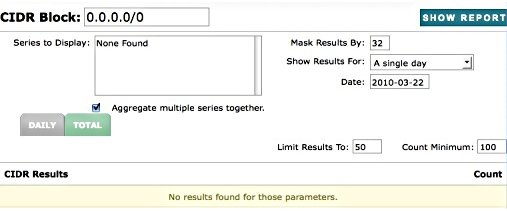

|     |     |     |
| --- | --- | --- |
| [Prev](web3.reports)  | Chapter 3. Using the Web Console |  [Next](web3.administration) |

## 3.7. The Paths Page

**Configuration Change. ** This feature is available starting from Momentum 3.0.23.

As of version 3.0.23, the Paths page is available for Momentum for Receiving. When Momentum is first installed, no audit series are displayed on this page.

**Figure 3.30. Paths**

In order to populate the Series to display text area, set up audit_series for the types of events you wish to view such as connections, messages and spam. In order to do this you must first load and configure the inbound_audit module. For instructions on doing this see [inbound_audit](https://support.messagesystems.com/docs/web-ref/modules.inbound_audit).

Once the inbound_audit module is loaded, you can create audit series as described in [Sieve audit_series](https://support.messagesystems.com/docs/web/sieve.ecaddons#sieve.ectypes_audit_series) and [audit_series](https://support.messagesystems.com/docs/web/sieve.ref.audit_series). The audit series that you create will show up in the Series to display text area. Select a CIDR block and the series that you wish to display and click the SHOW REPORT button. You should see something similar to the following:

**Figure 3.31. CIDR results**

The audit series that you select are displayed to the right of the IP address. To view the details for a specific IP address, click the IP address.

|     |     |     |
| --- | --- | --- |
| [Prev](web3.reports)  | [Up](web3) |  [Next](web3.administration) |
| 3.6. The Reporting Page  | [Table of Contents](index) |  3.8. Administration |
