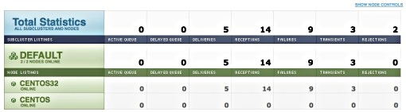

|     |     |     |
| --- | --- | --- |
| [Prev](web3.dashboard)  | Chapter 3. Using the Web Console |  [Next](web3.filters) |

## 3.4. Cluster Status

Choose the STATUS menu option to view the status of all the nodes in your cluster.

**Figure 3.7. Node status**

Use this page for a quick overview of the status of individual nodes and for determining whether nodes are online or not.

Use the SHOW NODE CONTROLS link to display buttons for restarting or shutting down specific nodes.

|     |     |     |
| --- | --- | --- |
| [Prev](web3.dashboard)  | [Up](web3) |  [Next](web3.filters) |
| 3.3. The Dashboard  | [Table of Contents](index) |  3.5. Filtering |
