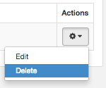
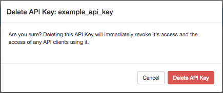

| [Prev](web-ui.apikeys.update)  | Chapter 44. Managing Your API Keys |  [Next](message_gen) |

## 44.4. Deleting an API Key

From the Settings section, you can delete an API key. Click the icon to the right of the API key that you want to delete. In the list, click Delete, as shown in [Figure 44.6, “Delete API Key”](web-ui.apikeys.delete#figure_delete_apikey "Figure 44.6. Delete API Key").

**Figure 44.6. Delete API Key**

In the Delete API Key window, click Delete API Key to confirm your request, as shown in [Figure 44.7, “Confirm Delete”](web-ui.apikeys.delete#figure_confirm_delete_apikey "Figure 44.7. Confirm Delete").

**Figure 44.7. Confirm Delete**

Deleting an API key revokes all future actions that requests with that API key will take. This is irreversible.

If the API key is successfully deleted, a message will display upon return to the Settings section. Click the x to close the message.

| [Prev](web-ui.apikeys.update)  | [Up](web-ui.apikeys) |  [Next](message_gen) |
| 44.3. Updating an API Key  | [Table of Contents](index) |  Chapter 45. Generating a Transmission |

