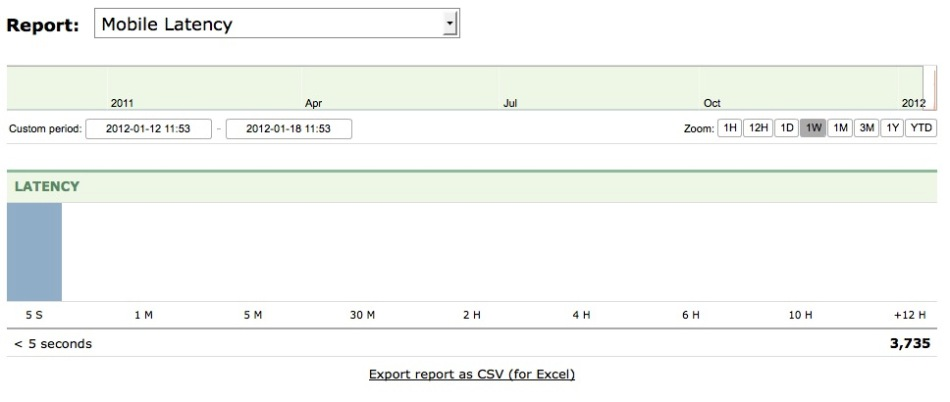
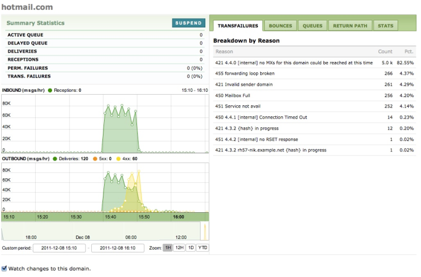
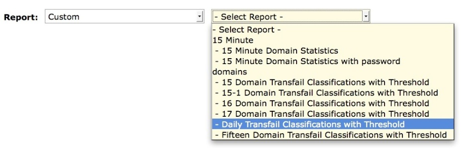
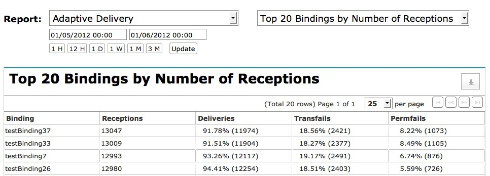
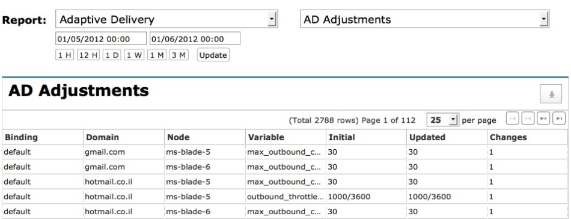
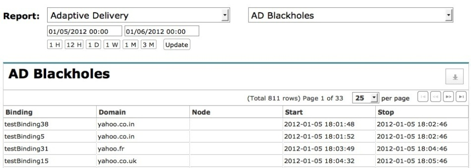

|     |     |     |
| --- | --- | --- |
| [Prev](web3.filters)  | Chapter 3. Using the Web Console |  [Next](web3.paths_page) |

## 3.6. The Reporting Page

Navigate to the Reports page and choose from the following options presented in the Report list box.

*   Deliveries

*   Rejections (As of version 3.0.23.)

*   Bounces

*   Transient Failures

*   Delivery Times

*   Long & Short Codes (Mobile Momentum only)

*   Mobile Latency (Mobile Momentum only)

*   Domain

*   Adaptive Delivery (Available only when the adaptive module is loaded)

### Note

The various reports displayed under this menu are based on the watchlist rather than all traffic. The watchlist is a schema that is created automatically in the ecelerity PostgreSQL database. If you wish to see stats for all domains you need to change the value of the `rt_stats_watchlist_only` option in the ec_rotate.conf file.

As of Momentum version 3.3, a reporting role has been added. For more information see [Section 3.9.1, “Adding the Reporting Role to a User”](web3.users#web3.reporting.role.creating "3.9.1. Adding the Reporting Role to a User").

### 3.6.1. Deliveries

When you first navigate to the Reporting page, delivery statistics are displayed. You should see a report such as the following:

<a name="figure_delivery_reports"></a>

**Figure 3.10. Delivery reports**


You can expand the information about a domain by clicking the + to the left of a domain name. Doing this displays:

*   Delivered

*   In-Band Bounces

*   Out-of-Band Bounces

*   Permanent Failures

*   Max Delivery Time

As with other reporting menus, you can select the period show, and export data to a CSV file if you wish.

### 3.6.2. Rejections

**Configuration Change. ** This feature is available starting from Momentum 3.0.23.

To view rejections select `Rejections` from the list box on the REPORTING page. You should see something similar to the following:

<a name="figure_rejection_reports"></a>

**Figure 3.11. Rejection report**


As with other reporting menus, you can select the period shown, view detail by clicking + and also export data to a CSV file if you wish.

### 3.6.3. Bounces

Overall bounce statistics are detailed on the left side of the page. Domain-specific information is detailed on the right hand side.

To view the bounce report select `Bounces` from the list box on the REPORTING page. You should see something similar to the following:

<a name="figure_bounce_reports"></a>

**Figure 3.12. Bounce reports**


As with other reporting menus, you can select the period show, and export data to a CSV file if you wish.

To view details relating to a specific domain, click the + to the left of a domain name. Doing this takes you to the domain view discussed in [Section 3.6.8, “Domain”](web3.reports#web3.reports.domains "3.6.8. Domain").

### 3.6.4. Transient Failures

This page displays overall transient failure statistics and the top twenty watched domains with transient failures.

<a name="figure_transient_failures"></a>

**Figure 3.13. Transient failures**


You can toggle the details of a top twenty domain using the button to the left of the domain name.

### 3.6.5. Delivery Times

Use the Delivery Times link for a graphical display of deliveries as shown in the following:

<a name="figure_deliveries_receptions"></a>

**Figure 3.14. Deliveries and receptions**


### 3.6.6. Long & Short Codes (Mobility only)

Use the Long & Short Codes link for a graphical display of SMS data by protocol as shown in the following:

<a name="figure_long_short_codes"></a>

**Figure 3.15. Long & Short Codes**


Choose how data is displayed by selecting from the list box on the left side of the report. Use the list box on the right for displaying:

*   in number of messages

*   in volume of messages

*   in segments

### 3.6.7. Mobile Latency (Mobility only)

Use the Mobile Latency link for a graphical display of latency as shown in the following:

<a name="figure_mobile_latency"></a>

**Figure 3.16. Mobile latency**



To download a CSV file of this report, click the Export report as CSV (for Excel) link. The data associated with the report shown in [Figure 3.16, “Mobile latency”](web3.reports#figure_mobile_latency "Figure 3.16. Mobile latency") is as follows:

```
"Mobile Latency Breakdown"
"Time Range",Count
"< 5 seconds","3,735"
"5 seconds - 30 seconds",0
"30 seconds - 1 minutes",0
"1 minutes - 2 minutes",0
"2 minutes - 5 minutes",0
"5 minutes - 10 minutes",0
"10 minutes - 30 minutes",0
"30 minutes - 1 hours",0
"1 hours - 2 hours",0
"2 hours - 3 hours",0
"3 hours - 4 hours",0
"4 hours - 5 hours",0
"5 hours - 6 hours",0
"6 hours - 8 hours",0
"8 hours - 10 hours",0
"10 hours - 12 hours",0
"More than 12 hours",0
```

### 3.6.8. Domain

To view the report for a domain, select `Domain` from the list box on the REPORTING page. When you make this selection, you are first prompted for the name of a domain. After entering one, you should see something similar to the following:

<a name="figure_domain_reports"></a>

**Figure 3.17. Domain reports**



As with other reporting menus, you can select the period shown.

When this page is first opened, the Transfails tab is selected. This tab shows transient failures by reason as shown in [Figure 3.17, “Domain reports”](web3.reports#figure_domain_reports "Figure 3.17. Domain reports").

Use the Bounces tab to display hard bounces by classification.

Choose the Queues tab to display the messages in the queues. You should see something similar to the following:

<a name="figure_domain_queues"></a>

**Figure 3.18. Domain queues**


By default messages in both the active and the delayed queues are shown. You can change this using the Show list box. After doing this, refresh the display using the SHOW button.

You can retry, bounce or purge the entire domain using the buttons bearing the action names.

View message details by clicking the + button beside a message. You can retry, bounce or purge a specific message using the buttons that are exposed along with message details.

The RETURN PATH tab is for users who subscribe to the [Return Path](http://www.returnpath.net) services. It shows a deliverability report for the current domain.

The STATS tab displays the following columns:

*   binding name

*   active queue

*   delayed queue

*   recipients

*   delivered

*   permanent failures

*   transient failures

### 3.6.9. Custom Reports

**Configuration Change. ** This feature is available as of version 3.3.

To view custom reports select the Custom option from the Reports drop-down list box on the REPORTING page. Available reports are shown in the list box on the right as pictured below:

<a name="figure_custom_reports"></a>

**Figure 3.19. Custom reports**



### Note

To create custom reports, see your Professional Services representative.

Note that the Custom reporting option will not appear if there are no custom reports defined in the system.

Riak server failure may cause unpredictable results for Custom reports. If, for example, the Custom Reports menu item disappears, this may indicate that a Riak server has failed.

After selecting a report, you should see something similar to the following:

<a name="figure_custom_report_data"></a>

**Figure 3.20. Report data tab**


The REPORT DATA tab shows the parameters that are required in order to create a report. In the example show in [Figure 3.20, “Report data tab”](web3.reports#figure_custom_report_data "Figure 3.20. Report data tab"), a domain, date and threshold are required. You must supply a value for each parameter.

Once you have specified criteria, use the RUN REPORT button to display the data. You should see something like the following:

<a name="figure_run_report"></a>

**Figure 3.21. Report data**


Use the down arrow icon on the right above the report columns to download the report in CSV format. Use the icon beside the download icon to create a menu link to the current report.

The parameter listing along the top, which gives you a rough idea of how the report was created. For more detail see the DETAILS tab.

Use the RE-RUN button to rerun a report. The parameter interface will be displayed with the current values pre-filled. The user may alter these before running the report again.

### 3.6.10. Adaptive Reports

### Note

This menu option is available as of Momentum version 3.3 and is only applicable if you are using the adaptive module and have set `enable_jlog` to `true`. For more information see [Section 14.2, “adaptive – Adaptive Delivery”](modules.adaptive "14.2. adaptive – Adaptive Delivery").

Adaptive reports are dependent upon the [adaptive_loader](executable.adaptive_loader "adaptive_loader") script.

To view adaptive reports, click the Reporting tab and choose Adaptive Delivery from the drop-down list box. You should see something similar to the following:

<a name="figure_ad_reports"></a>

**Figure 3.22. Adaptive reports**


When you choose `Adaptive Reports` the following reports are available from the drop-down list box on the right:

*   Top 20 Bindings by Number of Receptions – This report has the following column headers: Binding, Receptions, Deliveries, Transfails and Permfails.

*   Top 20 Domains by Number of Receptions – This report has the same column headers as "Top 20 Bindings by Number of Receptions".

*   Binding/Domains Modified by AD – This report has the same column headers as "Top 20 Bindings by Number of Receptions".

*   Bounce Classes by Specific Adaptive – This report has the following column headers: Binding/Domain, Bounce Class, Transfails and Permfails

*   AD Adjustments – This report has the following column headers: Binding, Domain, Node, Variable, Initial, Updated and Changes

*   AD Suspensions – This report has the following column headers: Binding, Domain, Node, Start and Stop

*   AD Blackholes – This report has the same column headers as "AD Suspensions"

*   Top 20 Permanent Failure Reasons – This report has the following column headers: Reason and Bounced

*   AD Summary/Statistics Report – This report has the following column headers: Receptions, Deliveries, Transfails and Permfails

**3.6.10.1. Adaptive Delivery Report Details**

The bindings and domains reports show the top twenty bindings and domains. The Adaptive Delivery bindings report is shown below:

<a name="figure_ad_report_bindings"></a>

**Figure 3.23. Bindings report**



Use the down arrow button to the right of a report name to download the current report in CSV format.

To fine-tune the time period for a report choose from the controls below the Report list box. You can manually specify a start and end time using the text boxes immediately below the Report list box. For ease of use, clicking in either of these text boxes displays a calendar widget. For a fixed time period, such as the previous week, use the appropriate button. Click Update after choosing a period.

By default the bindings report is sorted by receptions. You can change the way that any report is sorted by clicking a column heading. For example, to sort by deliveries click the Deliveries header.

The domains report has the same format as the bindings report.

The Bindings/Domains Modified by AD report is as follows:

<a name="figure_ad_report_modified"></a>

**Figure 3.24. Bindings/Domains modified**


The Adaptive Delivery bounce classes report is as follows:

<a name="figure_ad_report_bounce_classes"></a>

**Figure 3.25. Bounce classes**


Any custom codes set up using [Section 14.12, “bounce_classifier_override – The Bounce Classifier Override Module”](modules.bounce_classifier_override "14.12. bounce_classifier_override – The Bounce Classifier Override Module") will also show up in this report. The text associated with a custom code is User-Defined Classification: *`code_number`*.

The Adaptive Delivery adjustments report is as follows:

<a name="figure_ad_report_adjustments"></a>

**Figure 3.26. Adjustment reports**



The Adaptive Delivery blackholes report is as follows:

<a name="figure_ad_report_blackholes"></a>

**Figure 3.27. Blackholes report**



The Adaptive Delivery suspensions report has the same column headers as "AD Blackholes".

The Adaptive Delivery top twenty permanent failures report is as follows:

<a name="figure_ad_report_perm_failure"></a>

**Figure 3.28. Permanent failures**


The Adaptive Delivery summary statistics report is as follows:

<a name="figure_ad_report_summary"></a>

**Figure 3.29. Summary statistics**


|     |     |     |
| --- | --- | --- |
| [Prev](web3.filters)  | [Up](web3) |  [Next](web3.paths_page) |
| 3.5. Filtering  | [Table of Contents](index) |  3.7. The Paths Page |
